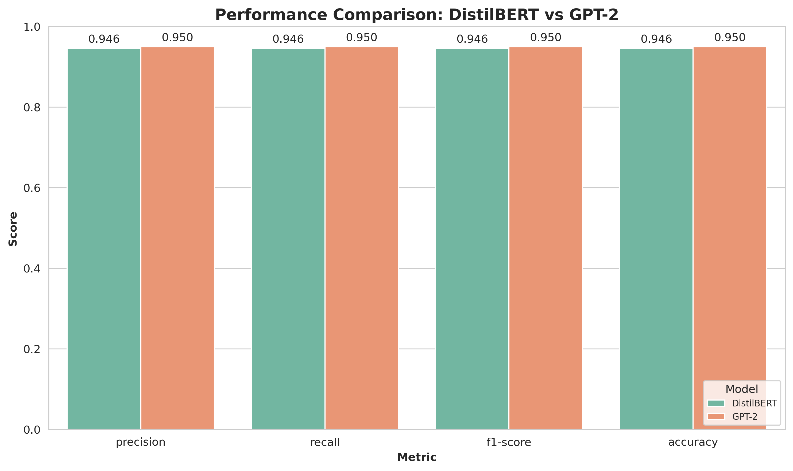

# LLM-News-Classifier
A flexible framework for fine-tuning BERT, GPT-2, and other Large Language Models (LLMs) on news classification tasks. It leverages the power of transformer-based models to accurately categorize news articles into predefined topics.

## Features

- Support for multiple pre-trained models (DistilBERT, GPT-2, BERT)
- Customizable training pipeline
- Efficient data processing and tokenization
- Flexible configuration options for model training
- Evaluation and prediction capabilities

## Results

We compared the performance of DistilBERT and GPT-2 models on the AG News classification task using their default parameters. Here are the results:

### Performance Comparison Table

| Metric    | GPT-2    | DistilBERT | Difference |
|-----------|----------|------------|------------|
| precision | 0.949706 | 0.945970   | 0.003736   |
| recall    | 0.949605 | 0.945789   | 0.003816   |
| f1-score  | 0.949623 | 0.945830   | 0.003793   |
| accuracy  | 0.949605 | 0.945789   | 0.003816   |

### Performance Comparison Chart



The table and chart above show the comparative performance of GPT-2 and DistilBERT models across different metrics, using their default parameters. The 'Difference' column in the table represents GPT-2's performance minus DistilBERT's performance.

The chart provides a visual representation of the performance metrics, allowing for easy comparison between the two models. For more detailed analysis or to explore the effects of different hyperparameters, please refer to the analysis notebooks in the repository.

## Data

The project is designed to work with the AG News dataset by default, but it can be easily adapted to other text classification datasets. The AG News dataset consists of news articles categorized into four classes: World, Sports, Business, and Sci/Tech.

## Installation

1. Clone the repository:
   ```
   git clone https://github.com/yourusername/LLM-News-Classifier.git
   cd LLM-News-Classifier
   ```

2. Create a virtual environment (optional but recommended):
   ```
   python -m venv venv
   source venv/bin/activate  # On Windows, use `venv\Scripts\activate`
   ```

3. Install the required packages:
   ```
   pip install -r requirements.txt
   ```

4. Install the project in editable mode:
   ```
   pip install -e .
   ```

## Usage

### Training a model

To fine-tune a DistilBERT model:

```bash
python scripts/train_distilbert.py --model_name distilbert-base-uncased --num_epochs 3 --batch_size 32 --output_dir ./distilbert_news_classifier --run_name distilbert_run_1
```

The `run_name` argument allows you to specify a unique identifier for each training run. This helps in organizing your output files and distinguishing between different experiments.

To fine-tune a GPT-2 model:

```bash
python scripts/train_gpt2.py --model_name gpt2 --num_epochs 3 --batch_size 16 --output_dir ./gpt2_news_classifier --run_name gpt2_run_1
```

## Project Structure

- `src/`: Contains the core components of the project
  - `models.py`: Defines the `NewsClassificationModel` class
  - `tokenizer.py`: Implements the `NewsTokenizer` class for text processing
  - `trainer.py`: Contains the `NewsTrainer` class for model training
  - `dataloader.py`: Implements the `NewsDataLoader` class for efficient data loading
- `scripts/`: Contains training scripts for different models
  - `train_distilbert.py`: Script for training DistilBERT models
  - `train_gpt2.py`: Script for training GPT-2 models
- `notebooks/`: Contains Jupyter notebooks for analysis
  - `Model_Analysis.ipynb`: Notebook for analyzing and comparing model performance
- `results/`: Stores output files and visualizations
  - `fig.png`: Performance comparison chart for DistilBERT and GPT-2 models

## Contributing

Contributions to this project are welcome! Please feel free to submit a Pull Request.

## License

This project is licensed under the MIT License - see the LICENSE file for details.